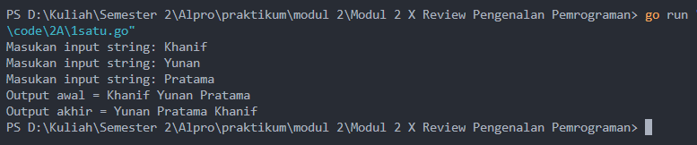

<h1 align="center">Laporan Praktikum Modul 2 <br>Review Pengenalan Pemrograman</h1>
<p align="center">KHANIF YUNAN PRATAMA - 103112430017</p>


## Dasar Teori
Pemrograman dengan bahasa Go memiliki struktur yang sederhana namun kuat, dengan aturan penulisan yang jelas dan efisien. Setiap program utama harus memiliki package main dan func main() sebagai titik awal eksekusi. Proses pengembangan melibatkan penulisan kode dalam file .go, kompilasi menggunakan go build, dan eksekusi melalui terminal. Go menyediakan berbagai tipe data seperti integer, float, boolean, dan string, serta mendukung deklarasi variabel yang fleksibel. Selain itu, bahasa ini memiliki kontrol alur yang mencakup perulangan for dalam berbagai bentuk dan percabangan dengan if-else serta switch-case untuk pengambilan keputusan.

## Unguided

### Soal Latihan 2A

#### Soal 1

> Telusuri program berikut dengan cara mengkompilasi dan mengeksekusi program. Silakan masukan data yang sesuai sebanyak yang diminta program. Perhatikan keluaran yang diperoleh. Coba terangkan apa sebenarnya yang dilakukan program tersebut?

```go
package main

import "fmt"

func main() {

    var (
        satu, dua, tiga string
        temp            string
    )

    fmt.Print("Masukan input string: ")
    fmt.Scanln(&satu)

    fmt.Print("Masukan input string: ")
    fmt.Scanln(&dua)

    fmt.Print("Masukan input string: ")
    fmt.Scanln(&tiga)

    fmt.Println("Output awal = " + satu + " " + dua + " " + tiga)

    temp = satu
    satu = dua
    dua = tiga
    tiga = temp

    fmt.Println("Output akhir = " + satu + " " + dua + " " + tiga)

}
```
>

Kode diatas merupakan program yang akan menerima tiga buah inputan dari user, kemudian menyimpan inputan tersebut dan menampilkannya kembali. Output yang ditampilkan merupakan output awal yaitu tiga kata yang dimasukan akan disusun secara berurutan, sesuai dengan urutan ketika kita memasukan inputan ke program di awal. Dan untuk output akhir berisikan susunan kata yang berubah, dimana bergeser (Kata 2 menjadi pertama, 3 menjadi 2 dan 1 menjadi 3). Kuncinya adalah ada di perubahan variabel dibawah ini:

```go
temp = satu
satu = dua
dua = tiga
tiga = temp
```

